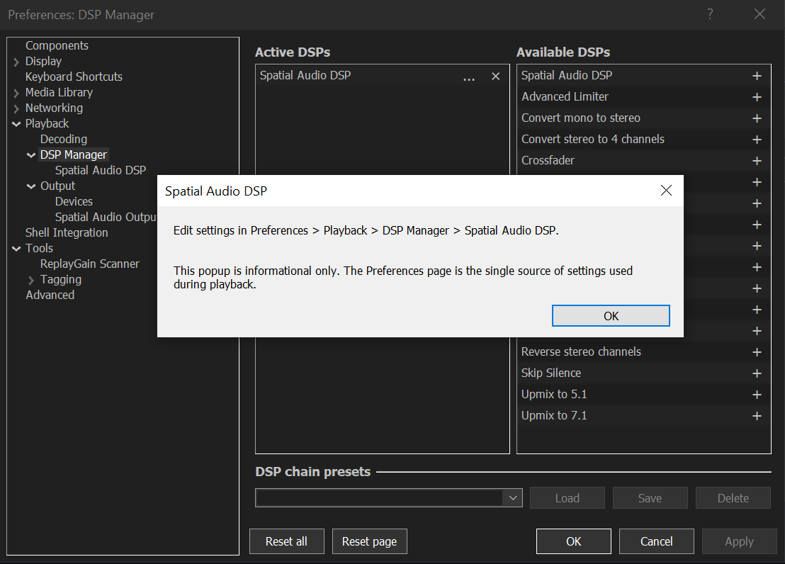
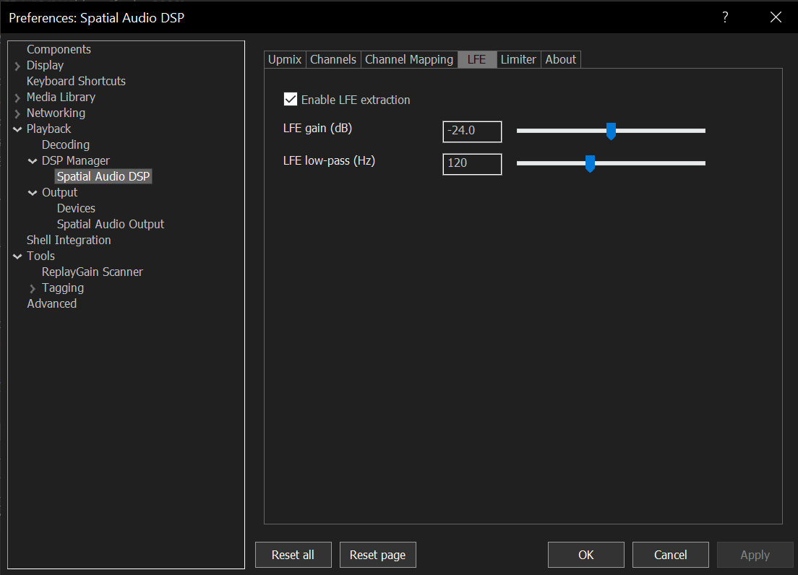
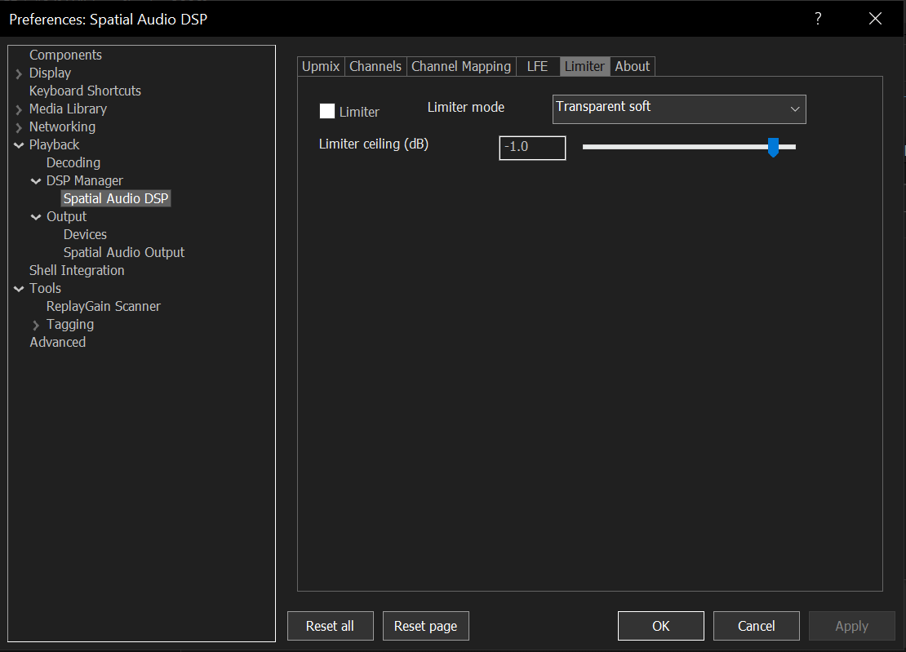
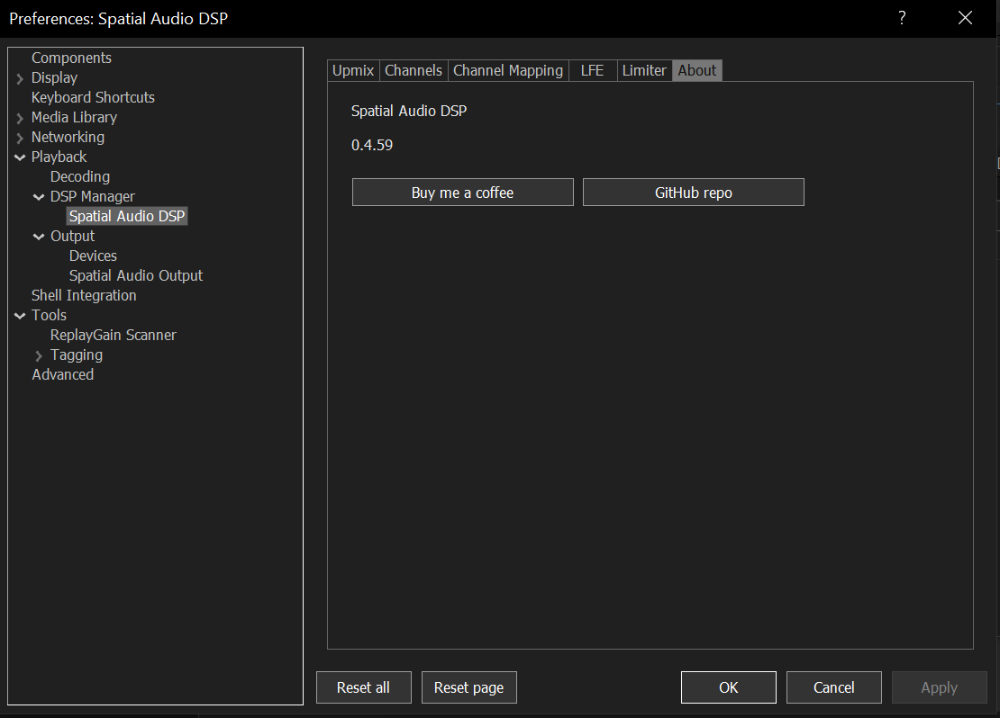
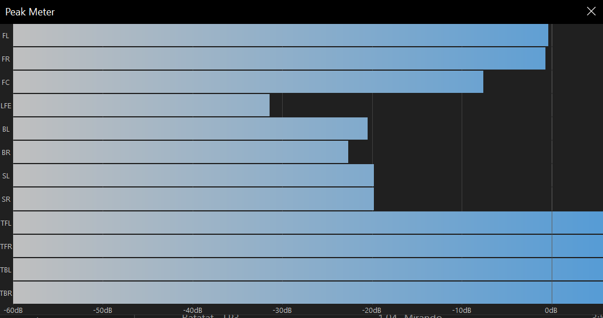

# Foobar for Home Theater

Foobar for Home Theater is a foobar2000 component package for Windows home theater playback. It combines a spatial upmix DSP with a Windows Spatial Audio output, so foobar2000 can play stereo, 5.1, 7.1, height, and front-wide layouts through an HDMI/eARC Spatial Audio endpoint.

The package contains three components:

- `foo_dsp_spatial` - `Spatial Audio DSP`. This creates and shapes the speaker bed: stereo upmix, 5.1/7.1 mapping, height channels, front-wide channels, LFE extraction, limiter, gain, delay, and polarity.
- `foo_dsp_height` - `Add Ceiling Speakers`. This chain-friendly DSP preserves an existing stereo/surround bed and adds only missing top-front or top-front/top-back channels. Use it after another 5.1/7.1 upmixer.
- `foo_out_spatial_audio` - `Spatial Audio Output`. This sends the bed to Windows Spatial Audio using static bed objects, plus dynamic objects only when the selected/incoming layout needs front-wide channels.

Use one of the DSP paths before the output: the full `Spatial Audio DSP`, or your preferred surround DSP followed by `Add Ceiling Speakers`. The output sends the resulting bed to Windows.

## Features

- Correct stereo upmix into surround and height beds.
- 5.1, 7.1, 5.1.2, 5.1.4, 7.1.4, 9.1, 9.1.2, and 9.1.4 DSP output layouts.
- Output `Auto` mode that follows the audio bed produced by the DSP.
- Front-wide support through explicit 9.x layouts. Windows has no static front-wide Spatial Audio bed object, so front-wide channels are sent as dynamic objects when available.
- Endpoint probe that shows supported static bed channels, requested channels, missing channels, dynamic object count, and dynamic front-wide status.
- One-shot directional test controls for routing checks.
- LFE extraction for stereo sources.
- Transparent soft limiter for clipping protection after upmixing.
- Per-channel gain, delay, and polarity.
- 5.1 source channel mapping.
- Copy/paste DSP profiles.
- A separate height-only DSP with preset-local configuration and bit-preserving passthrough for every existing channel.

## Download

Download the latest release assets:

- [`foo_dsp_spatial.fb2k-component`](https://github.com/ArtifexEt/Foobar-for-Home-Theater/releases/latest/download/foo_dsp_spatial.fb2k-component)
- [`foo_dsp_height.fb2k-component`](https://github.com/ArtifexEt/Foobar-for-Home-Theater/releases/latest/download/foo_dsp_height.fb2k-component)
- [`foo_out_spatial_audio.fb2k-component`](https://github.com/ArtifexEt/Foobar-for-Home-Theater/releases/latest/download/foo_out_spatial_audio.fb2k-component)

Release notes and older builds are on the [GitHub releases page](https://github.com/ArtifexEt/Foobar-for-Home-Theater/releases).

## Requirements

- foobar2000 2.x 64-bit.
- Windows 10 or Windows 11.
- A Windows Spatial Audio compatible HDMI/eARC endpoint, usually an AVR, TV, or soundbar.
- Spatial sound enabled for the endpoint in Windows sound settings.
- A DSP chain where either `Spatial Audio DSP`, or another upmixer followed by `Add Ceiling Speakers`, runs before `Spatial Audio Output`.

The plugin cannot make a non-Spatial endpoint spatial. If Windows reports no static bed and no dynamic objects, the output component has nothing useful to address.

## Install

1. Install `foo_out_spatial_audio` and the DSP component(s) you intend to use from the release ZIP's `components` directory.
2. Restart foobar2000 when prompted.
3. Open `Preferences > Playback > DSP Manager`.
4. Add `Spatial Audio DSP` to `Active DSPs` for the integrated upmix path, or follow the alternative chain below.
5. Open `Preferences > Playback > Output`.
6. Select `Spatial Audio Output`.
7. Open `Preferences > Playback > DSP Manager > Spatial Audio DSP`.
8. Press `Beginner defaults` if you are starting fresh.
9. Open `Preferences > Playback > Output > Spatial Audio Output`.
10. Keep `Output bed` on `Auto (follow audio bed)` for normal use.
11. Press `Probe endpoint` and confirm that the active bed matches what your AVR/Windows endpoint reports.



The smaller DSP Manager popup is informational only. The real DSP settings live under `Preferences > Playback > DSP Manager > Spatial Audio DSP`.

For an existing surround upmixer, use this chain instead:

1. Add your 5.1/7.1 DSP first.
2. Add `Add Ceiling Speakers` immediately after it.
3. Open its DSP Manager configuration popup and choose two or four ceiling speakers.
4. Keep `Spatial Audio Output` last and set its output bed to `Auto`.

`Add Ceiling Speakers` has no separate Preferences page. Its layout and synthesis controls are stored in that DSP instance's preset. Existing channels, including existing height channels, are copied unchanged; only missing requested ceiling channels are synthesized.

## Recommended Setup

Start with this setup for a typical AVR:

- DSP `Output bed`: `Surround + height (7.1.4)` if your endpoint supports it, otherwise use the largest supported bed shown by the probe.
- Output `Output bed`: `Auto (follow audio bed)`.
- Output `Render rate`: `48000 Hz`.
- DSP `Mode`: `Reference`.
- DSP `Master gain`: `0.0 dB`.
- DSP channel gains: `0.0 dB`.
- DSP `LFE extraction`: enabled.
- DSP `Limiter`: enabled, `Transparent soft`.

`Beginner defaults` restores a safe starter profile with unity speaker trims. If the sound becomes harsh or too tall, reduce `Height gain` and `Height from mid` first.

## How It Works

`Spatial Audio DSP` receives normal foobar2000 PCM and rewrites it into the selected output layout. Stereo is upmixed, 5.1 input is mapped through the Channel Mapping page, and 7.1 keeps its standard bed channels. It is an integrated processor, not a bit-preserving add-on; do not put it after another upmixer when that upmixer's complete bed must be retained. Use `Add Ceiling Speakers` for that chain.

`Spatial Audio Output` opens a Windows Spatial Audio stream. In `Auto`, it inspects the incoming channel mask and activates matching Windows static bed objects. If the incoming bed contains front-wide channels (`FCL`/`FCR`), the output requests dynamic objects for those front-wide channels because Windows Spatial Audio does not expose front-wide as static bed objects.

`Add Ceiling Speakers` is intentionally narrower. It keeps the incoming channel mask and samples, appends missing height flags, and derives only those new channels from front difference, surround/rear feed, and a small center feed. This makes it suitable after a third-party surround DSP without replacing that DSP's center, LFE, side, or rear work.

That keeps dynamic objects explicit: they are used for selected or incoming 9.x front-wide layouts, not as a hidden replacement for the normal static bed path.

## 9.x, 9.4.4, and Bass Channels

The plugin supports front-wide layouts as 9.1, 9.1.2, and 9.1.4. These are the practical Windows Spatial Audio forms of a 9.x AVR speaker layout:

- Static bed: front, center, LFE, side, back, and height channels.
- Dynamic objects: front wide left and front wide right.

For a 9.4.4 physical room, configure the plugin as 9.1.4 and let the AVR handle bass management. Windows Spatial Audio exposes one static LFE object to this plugin. It does not provide separate addressable LFE objects for four independent subwoofers through this API path. Multiple physical subs are normally managed by the AVR or room correction system from the single LFE/bass-managed signal.

Use the output probe to confirm your actual endpoint. Different AVRs can report different static beds and different dynamic object counts.

## Configuration Guide

### DSP: Upmix


This page decides what the plugin creates.

- `Output bed` chooses the DSP channel bed. Use 7.1.4 for most height systems; use 9.1.x only when you want front-wide output and the output probe reports enough dynamic objects.
- `Mode` controls the upmix style. `Reference` is the recommended default. `Full spatial` is wider and more aggressive. `Front only` is useful for A/B checks.
- `Master gain` should normally stay at `0.0 dB`.
- `Headroom` can be lowered if you want extra safety before the limiter.
- `Center`, `Surround`, `Rear`, and `Height` gains tune generated channels.
- `Side amount`, `Height from mid`, and `Decorrelate` shape stereo extraction.
- `Beginner defaults` restores the recommended starter profile.

### DSP: Channels


Use this page for room/system correction after the upmix is basically right.

- `Gain` changes individual channel level.
- `Delay ms` delays a channel.
- `Inv` flips polarity.

Leave all gains at `0.0 dB` until you have a reason to change them.

### DSP: Channel Mapping


This page maps 5.1 source channels into the DSP bed. It does not replace the Output page. Use it when a 5.1 source should feed side speakers, back speakers, or another target differently.

### DSP: LFE



LFE extraction creates optional low-frequency content from stereo input.

- `Enable LFE extraction`: creates an LFE feed from stereo bass.
- `LFE gain`: level of the extracted LFE feed.
- `LFE low-pass`: cutoff for extracted bass.

This is one LFE feed. Multi-sub distribution is handled by the AVR.

### DSP: Limiter



The limiter catches peaks created by summing and upmixing.

- `Transparent soft` is the recommended default.
- `Hard ceiling` is stricter but more audible.
- Keep the ceiling below `0 dB` if you hear clipping.

### DSP: About



The DSP About tab shows the installed component version and support links.

### Output: Layout


Use `Auto (follow audio bed)` for normal playback. It follows the bed from the DSP, including 9.x front-wide beds when the incoming channel mask contains front-wide channels and the endpoint has enough dynamic objects.

Use fixed output modes only for testing or when you want to force a specific output shape. `Probe endpoint` is the most important diagnostic on this page:

- `Native static bed`: what Windows says the endpoint exposes as static speaker objects.
- `Requested static bed`: what the selected output layout asks for.
- `Active static bed after fallback`: what the plugin can actually activate.
- `Missing static channels`: requested static channels not exposed by the endpoint.
- `Dynamic channels required`: front-wide channels needed by 9.x layouts.
- `Max dynamic objects`: dynamic object count reported by Windows.

### Output: Test


The test page plays short one-shot tones. It is for routing checks only and does not save a continuous test tone into normal playback.

- `Direction` selects a speaker target.
- `Run selected` plays the chosen target.
- The speaker buttons play common directions quickly.
- `Prefer dynamic object` tests movable object positioning when possible. Front-wide test directions always require dynamic objects.

### Peak Meter



Use foobar2000 meters to check whether the DSP is producing the expected channels and whether any channel is hitting 0 dB too often. If the meter is constantly pinned, reduce aggressive upmix gains or add headroom.

## Sound Quality Notes

If a new setting sounds worse, test in this order:

1. Press `Beginner defaults`.
2. Set `Mode` to `Reference`.
3. Keep all channel gains at `0.0 dB`.
4. Keep output on `Auto`.
5. Probe the endpoint.
6. Use one-shot tests to confirm routing.
7. Watch the peak meter for clipping.

Most quality problems come from routing mismatch, excessive height/surround gain, clipping, or forcing an output bed the endpoint does not really expose.

## Build

GitHub Actions is the supported build path for release packages. The workflow downloads the official foobar2000 SDK during the build and packages all three `.fb2k-component` files. The main Windows ZIP contains them under `components/` in addition to the standalone tools.

Local SDK archives or extracted SDK folders are only for reference and should not be committed.

The standalone CMake tools can be built locally with Visual Studio 2022:

```powershell
cmake -S . -B build -G "Visual Studio 17 2022" -A x64
cmake --build build --config Release
```

The full release workflow also builds the foobar2000 components from `components/foo_dsp_spatial`, `components/foo_dsp_height`, and `components/foo_out_spatial_audio`.

## Standalone Tools

Release ZIPs include standalone diagnostics:

```powershell
.\SpatialAudioDiagnostics.exe --list-devices
.\SpatialAudioDiagnostics.exe --device korytarz --probe --config .\config\spatial_audio_profile.ini
.\SpatialAudioDiagnostics.exe --device korytarz --static-test --config .\config\spatial_audio_profile.ini
.\SpatialAudioDiagnostics.exe --probe --config .\config\spatial_audio_profile.ini
.\SpatialAudioDiagnostics.exe --static-test --config .\config\spatial_audio_profile.ini
.\SpatialAudioDiagnostics.exe --custom --config .\config\spatial_audio_profile.ini
.\StereoSpatialPlayer.exe --device korytarz --wav C:\path\to\stereo-48k.wav --mode bed --config .\config\spatial_audio_profile.ini
.\StereoSpatialPlayer.exe --wav C:\path\to\stereo-48k.wav --mode objects --config .\config\spatial_audio_profile.ini
```

`--device` accepts a case-insensitive fragment of the Windows render endpoint name or endpoint id. Use `--list-devices` first if you are not sure how Windows exposes the speaker, receiver, or hallway endpoint.

## Troubleshooting

- If output is silent, confirm that Windows Spatial Audio is enabled for the selected endpoint.
- If foobar2000 does not play through the expected speaker, select the named endpoint under `Playback > Output > Device` instead of the default Spatial Audio entry, then verify the same endpoint with `SpatialAudioDiagnostics.exe --device name --probe`.
- If the probe reports no supported spatial bed, select another Windows output device or enable spatial sound in Windows settings.
- If playback is too quiet after upgrading, press `Beginner defaults` or set `Master gain` to `0.0 dB`.
- If playback contains a tone after upgrading from an older test build, open and apply the output preferences once. New builds no longer persist continuous test tone playback.
- If channels are routed incorrectly, use the Output Test page first, then adjust DSP Channel Mapping only if the issue is source-specific.
- If 9.x front-wide output fails, run `Probe endpoint` and check `Max dynamic objects`. Front-wide channels need two dynamic objects.
- If a forced layout behaves badly, switch Output back to `Auto (follow audio bed)`.

## Notes

This project uses Windows Spatial Audio endpoint APIs. It does not encode Dolby Atmos, DTS:X, or any private bitstream format.

## Support

- [GitHub repository](https://github.com/ArtifexEt/Foobar-for-Home-Theater)
- [Support: Buy me a coffee](https://buymeacoffee.com/szymonrybka)

## Roadmap

The foobar2000 component plan is in [`docs/FOOBAR_COMPONENT_PLAN.md`](docs/FOOBAR_COMPONENT_PLAN.md).
