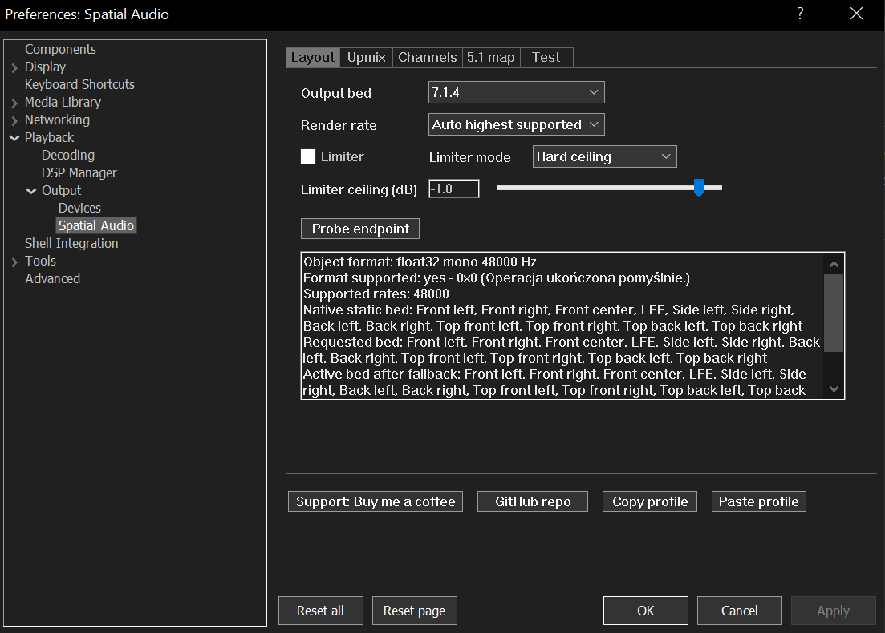
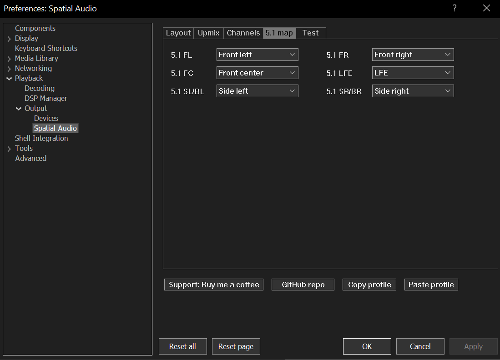
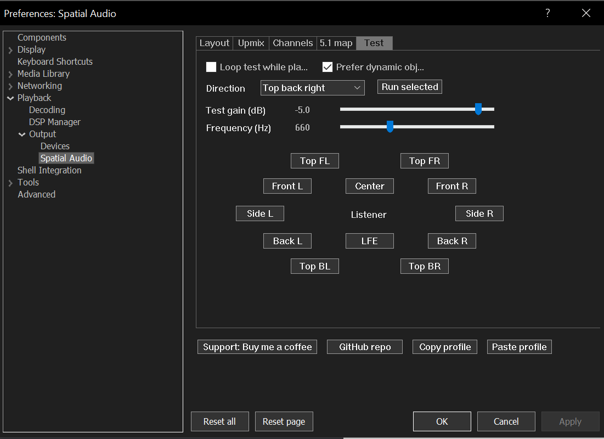

# Foobar for Home Theater

Windows Spatial Audio output component for foobar2000 home theater setups, plus standalone diagnostics used to validate the Windows endpoint.

`foo_out_spatial_audio` is an early foobar2000 output component. It takes foobar2000 stereo, 5.1, or 7.1 PCM, forces 48 kHz when needed, and renders it to the default Windows Spatial Audio endpoint as a home theater Spatial Audio bed.

The repository builds the Windows tools and foobar2000 component with GitHub Actions on `windows-2022`. The action can verify MSVC/CMake compilation, but real Spatial Audio playback must be tested on a Windows machine with a compatible HDMI/eARC endpoint.

## Download and install

1. Download the latest component release: [`foo_out_spatial_audio.fb2k-component`](https://github.com/ArtifexEt/Foobar-for-Home-Theater/releases/latest/download/foo_out_spatial_audio.fb2k-component).
2. In foobar2000, open Preferences > Components, click Install, choose the downloaded `.fb2k-component`, then Apply.
3. Restart foobar2000 when prompted.
4. Open Preferences > Playback > Output and select `Spatial Audio for Home Theater`.
5. Open Preferences > Playback > Output > Spatial Audio if you want to probe the Windows endpoint, run directional tests, or adjust channel gains. New installs use beginner-safe defaults, so no setup is required before first playback.

Release notes are published on the [GitHub releases page](https://github.com/ArtifexEt/Foobar-for-Home-Theater/releases). The release ZIP contains standalone diagnostics and test executables. The foobar2000 plugin itself is the `.fb2k-component` file linked above.

The component version shown inside foobar2000 is embedded during the GitHub Actions build and matches the release tag without the leading `v`, for example release `v0.3.30` installs as component version `0.3.30`.

## Screenshots

The component is configured from Preferences > Playback > Output > Spatial Audio. The defaults are intended to work for a first run, while the tabs below expose the parts most home-theater users usually need to tune.

### Layout and endpoint probe

Choose the Windows Spatial Audio bed, render rate, and limiter behavior. `Probe endpoint` asks Windows what the selected HDMI/eARC endpoint exposes, including supported float32 rates and native static bed channels.



### Upmix controls

Select the listening mode and tune how stereo is spread into center, surround, rear, height, and optional LFE channels. `Reference` is the safer default; `Full spatial` is wider and more aggressive.


### Per-channel trims

Adjust each 7.1.4 bed channel independently with gain, delay, and polarity inversion. This is useful when matching a receiver, speaker distance compensation, or a room correction profile.


### 5.1 source mapping

Map each 5.1 input channel to the Spatial Audio bed. This lets SL/SR, LFE, or center-heavy sources be routed to the speaker layout that works best for a specific receiver.



### Directional test pad

Play short tones from front, side, rear, height, and LFE directions. Positional channels can use dynamic Spatial Audio objects when supported; LFE always uses the static low-frequency bed channel.



## Requirements

- Windows 10/11 with a recent Windows SDK.
- Visual Studio 2022 with C++ desktop tools.
- CMake 3.24 or newer.
- A real HDMI/eARC endpoint with Windows Spatial Audio support selected as the default output device.
- Spatial sound enabled for that endpoint in Windows sound settings.
- foobar2000 2.x 64-bit for the component package.

The component settings live under Preferences > Playback > Output > Spatial Audio.

Stereo input is upmixed to the available Spatial Audio bed. 5.1 input can be mapped per source channel from the component settings: FL, FR, FC, LFE, SL/BL, and SR/BR can each target front, side, rear, height, LFE, or Disabled. 7.1 input is preserved to matching front, side, rear, center, and LFE bed channels.

The preferences page now exposes:

- Layout selection: Auto, Stereo, 5.1, 7.1, 5.1.2, and 7.1.4, with endpoint probe output.
- Render quality controls: 48 kHz compatible default, source sample rate if supported, auto highest supported, or fixed 44.1/88.2/96/176.4/192 kHz.
- Beginner-safe defaults: Auto bed, 48 kHz compatible render rate, Reference upmix, limiter on, and conservative gains.
- Upmix mode controls: Reference, Full spatial, and Front only for quick A/B comparison.
- Upmix sliders next to numeric values for master/headroom, center, surround, rear, height, width, height ambience, decorrelation, and LFE.
- Per-channel gain, delay, and polarity invert controls for the 7.1.4 bed.
- Copy/Paste profile buttons for sharing the full component settings through the clipboard.
- Tooltips on important controls for setup guidance without cluttering the settings page.
- A directional test pad that can play a short Spatial Audio tone from front, side, rear, ceiling, or LFE directions. If the endpoint supports dynamic objects, the test can use object coordinates for positional channels; LFE always uses the static low-frequency bed channel with a low test tone.
- Transparent soft limiter or hard ceiling limiter control to reduce accidental clipping.

## Quality

The component renders Windows Spatial Audio objects as mono float32 streams and keeps internal mix math in double precision. `Render rate` defaults to `48 kHz compatible` for broad HDMI/eARC receiver compatibility; use `Probe endpoint` to see which float32 object rates the selected Windows Spatial Audio endpoint accepts, then switch to `Auto highest supported` if your endpoint handles it cleanly.

For cleanest output, keep enough headroom for stereo upmixing, leave `Limiter` enabled in `Transparent soft` mode, and keep per-channel trims at or below 0 dB unless you are compensating for real speaker calibration.

## Support

[Support: Buy me a coffee](https://buymeacoffee.com/szymonrybka)

[GitHub repository](https://github.com/ArtifexEt/Foobar-for-Home-Theater)

## Build

Run these commands from the repository root.

```powershell
cmake -S . -B build -G "Visual Studio 17 2022" -A x64
cmake --build build --config Release
```

The foobar2000 component is built by the GitHub Actions workflow using the official foobar2000 SDK.

## Standalone Tools

```powershell
.\build\Release\SpatialAudioDiagnostics.exe --probe --config .\config\spatial_audio_profile.ini
.\build\Release\SpatialAudioDiagnostics.exe --static-test --config .\config\spatial_audio_profile.ini
.\build\Release\SpatialAudioDiagnostics.exe --custom --config .\config\spatial_audio_profile.ini
.\build\Release\StereoSpatialPlayer.exe --wav C:\path\to\stereo-48k.wav --mode bed --config .\config\spatial_audio_profile.ini
.\build\Release\StereoSpatialPlayer.exe --wav C:\path\to\stereo-48k.wav --mode objects --config .\config\spatial_audio_profile.ini
```

`--probe` prints endpoint capabilities.

`--static-test` plays sequential tone bursts through the configured static bed. With a 7.1.4 Spatial Audio endpoint, the important checks are `top_front_left`, `top_front_right`, `top_back_left`, and `top_back_right`.

`--custom` creates dynamic spatial objects from `config/spatial_audio_profile.ini` and positions them with Windows Spatial Audio coordinates.

`StereoSpatialPlayer.exe --mode bed` plays a stereo WAV through the configured static 7.1.4 bed. `--mode objects` plays the same WAV as dynamic spatial objects using `source`, `gain_db`, `x`, `y`, and `z` from the custom object sections.

Release ZIPs include the standalone executables and `config/spatial_audio_profile.ini` in the same default layout the executables expect. The component is published separately as `foo_out_spatial_audio.fb2k-component`.

## Notes

If `max dynamic objects` is `0`, Windows Spatial Audio is not enabled for the selected endpoint, the endpoint is not compatible, or only static bed playback is available.

The tools use Windows Spatial Audio endpoint APIs, not a private encoder.

## Roadmap

The foobar2000 component plan is in `docs/FOOBAR_COMPONENT_PLAN.md`.
