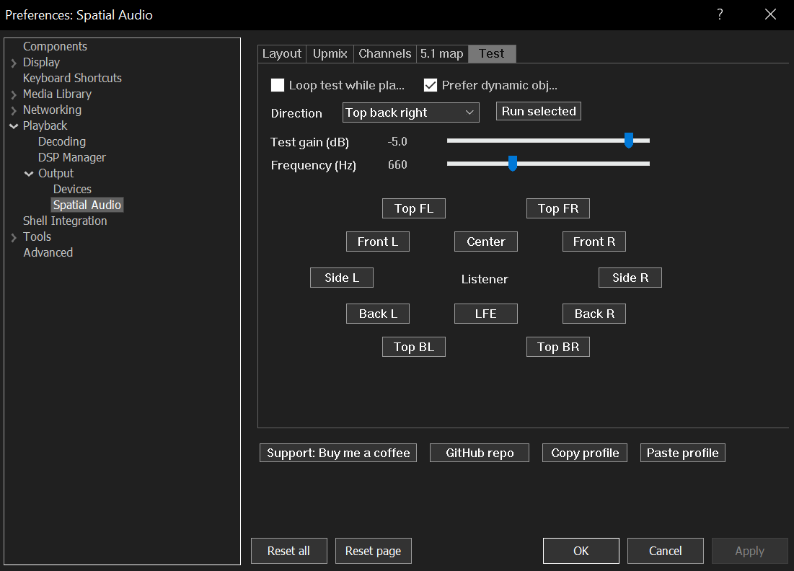
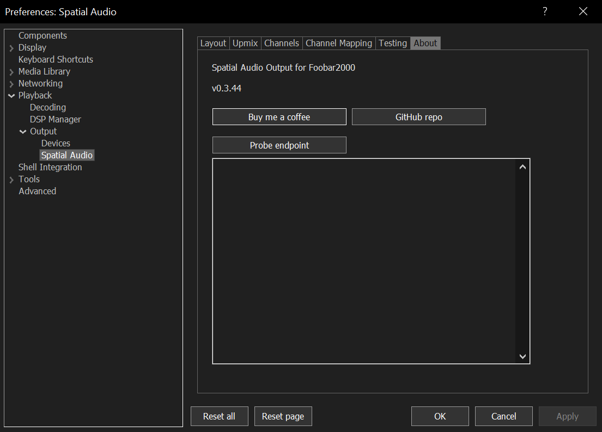
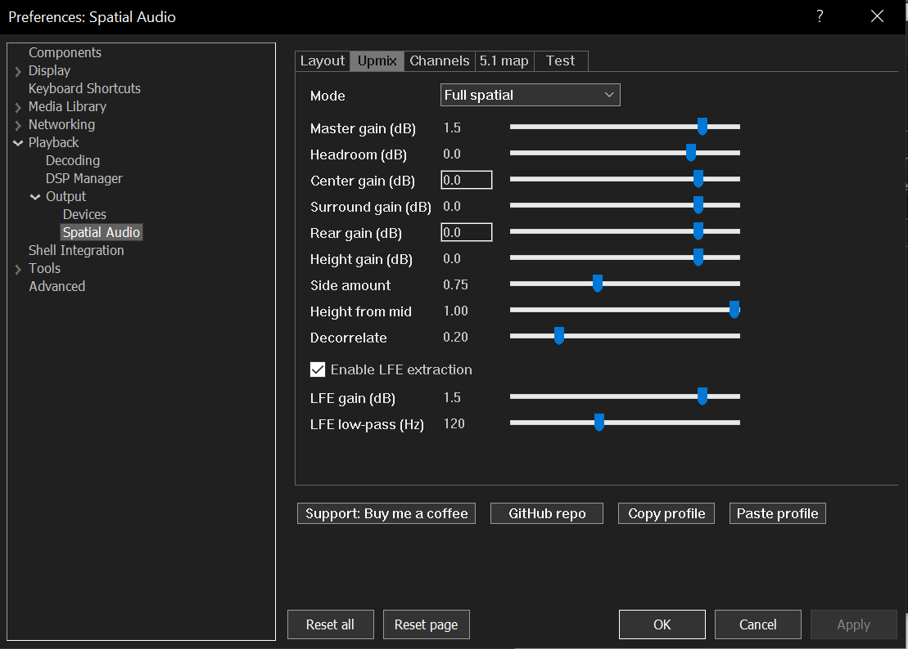
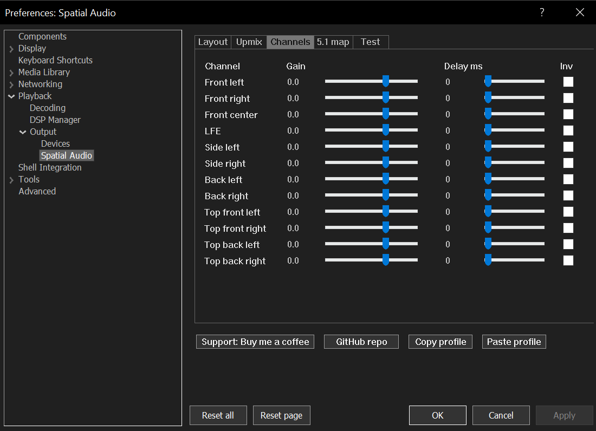
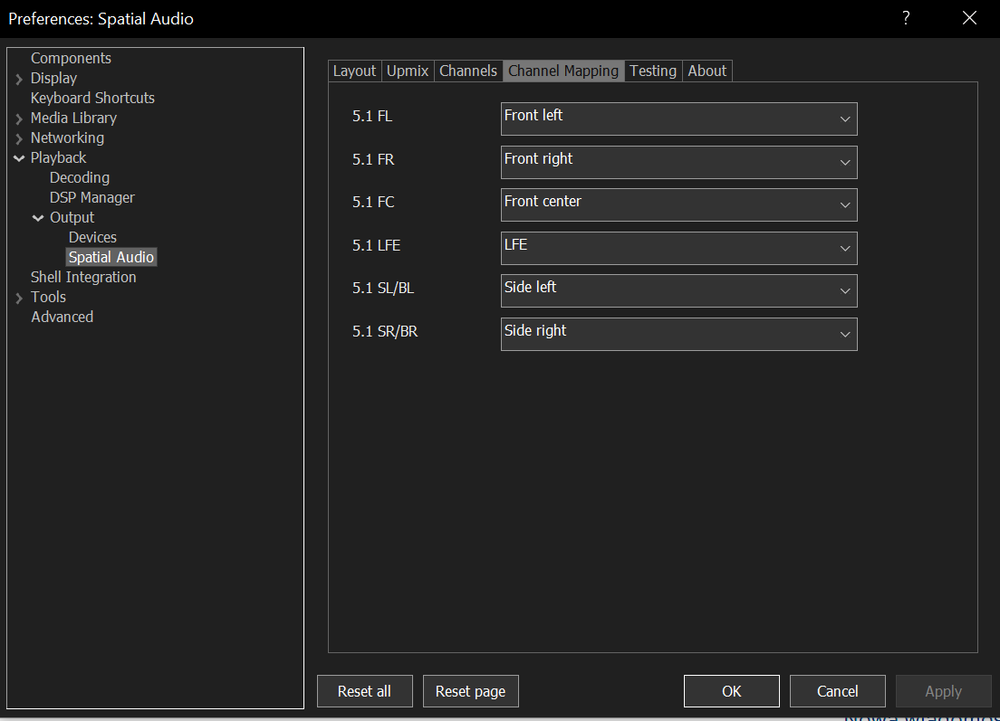

# Foobar for Home Theater

Foobar for Home Theater is a foobar2000 component package for Windows home theater playback. It combines a spatial upmix DSP with a Windows Spatial Audio output, so foobar2000 can play stereo, 5.1, and 7.1 music through a real HDMI/eARC spatial audio endpoint.

The package is built as two foobar2000 components:

- `foo_dsp_spatial` - Spatial Audio for Home Theater DSP. This is where audio is processed: stereo upmix, 5.1/7.1 channel handling, LFE extraction, limiter, channel trims, delays, polarity, and output bed selection.
- `foo_out_spatial_audio` - Spatial Audio for Home Theater output. This sends the channel bed from foobar2000 to the Windows Spatial Audio API using static bed objects and optional dynamic test objects.

Use both components together for the intended experience: the DSP prepares the bed, and the output component sends that bed to Windows Spatial Audio.

## Main Features

- Correct spatial upmix from stereo into surround and height beds.
- Output bed selection in the DSP: 5.1, 7.1, 5.1.2, 5.1.4, and 7.1.4.
- Output Auto mode that follows the channel bed produced by the playing audio or DSP.
- Windows Spatial Audio static bed rendering through `ISpatialAudioClient`.
- Endpoint probe inside the output preferences to show Windows Spatial Audio capabilities.
- Directional test tone controls for speaker routing checks.
- LFE extraction for stereo sources, enabled by beginner defaults.
- Transparent soft limiter to protect against clipping after upmixing.
- Per-channel gain, delay, and polarity controls.
- 5.1 source channel mapping to the chosen output bed.
- Copy/paste DSP profiles for sharing or backup.
- Same package naming and About tabs for the DSP and output components.

## Download

Download the latest release assets:

- [`foo_dsp_spatial.fb2k-component`](https://github.com/ArtifexEt/Foobar-for-Home-Theater/releases/latest/download/foo_dsp_spatial.fb2k-component)
- [`foo_out_spatial_audio.fb2k-component`](https://github.com/ArtifexEt/Foobar-for-Home-Theater/releases/latest/download/foo_out_spatial_audio.fb2k-component)

Release notes and older builds are available on the [GitHub releases page](https://github.com/ArtifexEt/Foobar-for-Home-Theater/releases).

The workflow artifact also contains standalone diagnostic tools. The foobar2000 plugins are the two `.fb2k-component` files above.

## Requirements

- foobar2000 2.x 64-bit.
- Windows 10 or Windows 11.
- A Windows Spatial Audio compatible endpoint, usually HDMI or eARC through an AVR, TV, or soundbar.
- Spatial sound enabled for the endpoint in Windows sound settings.
- A playback chain that can run foobar2000 DSP components before output.

Real Spatial Audio playback must be tested on a Windows machine with a compatible endpoint. If Windows reports zero spatial objects or no supported bed, the output component cannot make the device spatial by itself.

## Install

1. Install both `.fb2k-component` files in `Preferences > Components`.
2. Restart foobar2000 when prompted.
3. Open `Preferences > Playback > DSP Manager`.
4. Add `Spatial Audio for Home Theater DSP` to the active DSP chain.
5. Open `Preferences > Playback > Output`.
6. Select `Spatial Audio for Home Theater`.
7. Open the DSP preferences and press `Beginner defaults` if you are starting fresh.
8. In the output preferences, keep `Output bed` on `Auto` unless you need to force a specific bed.
9. Use the endpoint probe and test tone page to verify your receiver/soundbar routing.

## Recommended First Setup

For a normal home theater setup:

- DSP `Output bed`: start with `Surround + height (7.1.4)` if your device supports it, otherwise choose the largest bed your endpoint supports.
- Output `Output bed`: `Auto (follow audio bed)`.
- Render rate: `48000 Hz`.
- Upmix mode: `Reference`.
- Master gain: `0 dB`.
- Channel gains: `0 dB`.
- LFE extraction: enabled.
- Limiter: enabled, `Transparent soft`.

These are the beginner defaults. They avoid unnecessary global volume loss while keeping clipping protection active.

## How It Works

The DSP and output components have separate jobs.

`foo_dsp_spatial` receives normal foobar2000 PCM chunks. For stereo input, it creates a surround/height bed using the selected upmix mode. For 5.1 input, it maps the source channels to the selected bed. For 7.1 input, it preserves the matching surround channels. It then outputs PCM with a real channel count and channel mask for the selected bed: 5.1, 7.1, 5.1.2, 5.1.4, or 7.1.4.

`foo_out_spatial_audio` receives that bed and opens a Windows Spatial Audio stream. In Auto mode, it detects the incoming channel bed and activates the matching Windows Spatial Audio static objects. Each source channel is copied to its matching spatial bed object: front, center, LFE, side, back, and top channels.

That means the DSP decides what bed should be produced, and the output follows it. If the DSP is set to 5.1, the output sends a 5.1 bed. If the DSP is set to 7.1.4 and the endpoint supports it, the output sends 7.1.4.

## Correct Upmix

The DSP is not a simple channel duplicator. It separates the work into predictable stages:

- Front left and right remain the main stereo anchors.
- Center is created from mid content.
- Surround and rear channels use side/difference content and decorrelation controls.
- Height channels are derived from controlled mid and side content.
- LFE extraction is optional and low-pass filtered.
- Per-channel trims, delays, and polarity are applied after the bed is generated.
- The limiter runs at the end to catch peaks created by summing and upmixing.

`Reference` mode is the beginner-friendly mode. It keeps the upmix controlled and avoids excessive surround or height energy. `Full spatial` is wider and more aggressive. `Front only` is useful for A/B checks.

## Preferences

### DSP: Upmix

Controls the generated bed and upmix behavior.

- `Output bed` chooses how many channels the DSP produces.
- `Mode` chooses the upmix style.
- `Master gain` controls the global DSP level.
- `Center`, `Surround`, `Rear`, and `Height` gains tune generated channels.
- `Side amount`, `Height from mid`, and `Decorrelate` shape the stereo upmix.
- `Beginner defaults` restores the recommended unity-gain starter profile.
- `Copy profile` and `Paste profile` export/import all DSP settings as text.

### DSP: Channels

Fine-tunes each output bed channel independently:

- gain
- delay in milliseconds
- polarity inversion

### DSP: Channel Mapping

Maps 5.1 source channels to output bed targets. This is useful when a source uses a different surround convention or when you want 5.1 input to feed side/back channels differently.

### DSP: LFE

Controls optional low-frequency extraction from stereo input:

- enable/disable LFE extraction
- LFE gain
- low-pass frequency

### DSP: Limiter

Keeps the generated upmix from clipping:

- `Transparent soft` is the recommended default.
- `Hard ceiling` is stricter and more obvious.

### Output: Layout

Controls the Windows Spatial Audio output:

- `Auto (follow audio bed)` follows the incoming channel bed.
- Fixed modes can force stereo, 5.1, 7.1, 5.1.2, 5.1.4, or 7.1.4.
- `Render rate` defaults to `48000 Hz`, which is the safest HDMI/eARC choice.
- `Probe endpoint` asks Windows what the selected endpoint supports.

### Output: Test

Plays test tones through selected directions. Use this to confirm that Windows, the endpoint, and the speaker layout agree.

## Screenshots

The screenshots below are stored in `docs/screenshots/`. Replace them after a new build if the UI changes.

### Output Layout


### Output Test



### Output About



### DSP Upmix



### DSP Channels



### DSP Channel Mapping



## Build

GitHub Actions is the supported build path for release packages. The workflow downloads the official foobar2000 SDK during the build and packages both `.fb2k-component` files.

Local SDK archives or extracted SDK folders are only for reference and should not be committed.

The standalone CMake tools can be built locally with Visual Studio 2022:

```powershell
cmake -S . -B build -G "Visual Studio 17 2022" -A x64
cmake --build build --config Release
```

The full release workflow also builds the foobar2000 components from `components/foo_dsp_spatial` and `components/foo_out_spatial_audio`.

## Standalone Tools

Release ZIPs include standalone diagnostics:

```powershell
.\SpatialAudioDiagnostics.exe --probe --config .\config\spatial_audio_profile.ini
.\SpatialAudioDiagnostics.exe --static-test --config .\config\spatial_audio_profile.ini
.\SpatialAudioDiagnostics.exe --custom --config .\config\spatial_audio_profile.ini
.\StereoSpatialPlayer.exe --wav C:\path\to\stereo-48k.wav --mode bed --config .\config\spatial_audio_profile.ini
.\StereoSpatialPlayer.exe --wav C:\path\to\stereo-48k.wav --mode objects --config .\config\spatial_audio_profile.ini
```

- `--probe` prints endpoint capabilities.
- `--static-test` plays tone bursts through the configured static bed.
- `--custom` creates dynamic spatial objects from the config file.
- `StereoSpatialPlayer --mode bed` plays stereo WAV through a static bed.
- `StereoSpatialPlayer --mode objects` plays stereo WAV through dynamic spatial objects.

## Troubleshooting

- If the output is silent, confirm that Windows Spatial Audio is enabled for the selected endpoint.
- If endpoint probe reports no supported spatial bed, select another Windows output device or enable spatial sound in Windows settings.
- If playback is too quiet after upgrading from older builds, press `Beginner defaults` in the DSP page or set `Master gain` to `0 dB`.
- If channels are routed incorrectly, use the output test tone page first, then adjust 5.1 channel mapping if the problem is source-specific.
- If changing DSP layout causes output issues, keep the output component on `Auto (follow audio bed)`.

## Notes

This project uses Windows Spatial Audio endpoint APIs. It does not encode Dolby Atmos, DTS:X, or any private bitstream format.

The largest static bed currently supported by the package is 7.1.4. More channels would require a different object-based panning model rather than a normal channel-bed DSP.

## Support

- [GitHub repository](https://github.com/ArtifexEt/Foobar-for-Home-Theater)
- [Support: Buy me a coffee](https://buymeacoffee.com/szymonrybka)

## Roadmap

The foobar2000 component plan is in [`docs/FOOBAR_COMPONENT_PLAN.md`](docs/FOOBAR_COMPONENT_PLAN.md).
